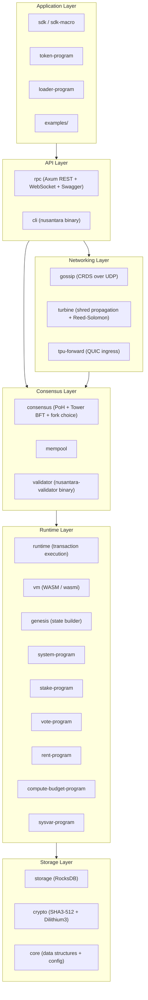

# Nusantara

**Post-quantum Layer 1 blockchain built for speed, security, and sovereignty.**

---

## What is Nusantara?

Nusantara is a high-performance Layer 1 blockchain inspired by Solana's architecture, redesigned with post-quantum cryptography from the ground up. It combines SHA3-512 hashing with Dilithium3 (ML-DSA-65) lattice-based signatures to provide quantum-resistant security without sacrificing throughput. The consensus layer pairs Proof of History (PoH) with Tower BFT for fast finality, while WASM smart contracts via the wasmi interpreter give developers a familiar and portable execution environment. Nusantara is written entirely in Rust (edition 2024) and targets production-grade performance with sub-second slot times.

## Key Specifications

| Property | Value |
|---|---|
| Hash function | SHA3-512 (64-byte output) |
| Signature scheme | Dilithium3 / ML-DSA-65 (post-quantum) |
| Public key size | 1,952 bytes |
| Secret key size | 4,032 bytes |
| Signature size | 3,309 bytes |
| Consensus | Proof of History + Tower BFT |
| Smart contracts | WASM (wasmi interpreter) |
| Slot duration | 900 ms |
| Epoch length | 432,000 slots (~4.5 days) |
| Native token | NUSA |
| Smallest unit | 1 lamport = 10^-9 NUSA |
| Fee per signature | 5,000 lamports |
| Serialization | Borsh (binary, deterministic) |
| User-facing encoding | Base64 URL-safe no-pad |
| Storage backend | RocksDB (17 column families) |
| Networking | UDP (gossip/turbine), QUIC (TPU) |
| Rust edition | 2024 (rustc 1.93+) |

## Architecture Overview



## Quick Start

### Prerequisites

- Rust 1.93+ (install via [rustup](https://rustup.rs/))
- RocksDB development libraries (`librocksdb-dev` / `brew install rocksdb`)
- Docker and Docker Compose (for devnet)

### Build from source

```bash
# Clone the repository
git clone https://github.com/nusantara-chain/chain.git
cd chain

# Build both binaries (nusantara-validator and nusantara)
cargo build --release

# Binaries are located at:
#   target/release/nusantara-validator
#   target/release/nusantara
```

### Run a single-node validator

```bash
# Generate a validator keypair
./target/release/nusantara keygen --output ~/.config/nusantara/validator-keypair.bin

# Start the validator
./target/release/nusantara-validator \
    --ledger-path ./ledger \
    --genesis-config ./genesis.toml \
    --gossip-addr 0.0.0.0:8000 \
    --rpc-addr 0.0.0.0:8899 \
    --metrics-addr 0.0.0.0:9090 \
    --enable-faucet

# In another terminal, check the validator
./target/release/nusantara slot
./target/release/nusantara balance
```

### Docker devnet (3 validators)

```bash
# Start a 3-validator devnet with monitoring stack
docker-compose up -d

# Services available:
#   http://localhost:8899   — Validator 1 RPC
#   http://localhost:8900   — Validator 2 RPC
#   http://localhost:8901   — Validator 3 RPC
#   http://localhost:8080   — Nginx load balancer
#   http://localhost:3000   — Grafana dashboards (admin/nusantara)
#   http://localhost:9093   — Prometheus

# Request an airdrop
./target/release/nusantara airdrop 10

# Stop the devnet
docker-compose down
```

## Project Structure

The workspace contains 25 crates organized into 6 layers plus testing and tooling.

### Foundation

| Crate | Package | Description |
|---|---|---|
| `crypto/` | nusantara-crypto | SHA3-512 hashing, Dilithium3 signatures, key types, Base64 encoding |
| `core/` | nusantara-core | Data structures, config constants, native token, program IDs |

### Native Programs

| Crate | Package | Description |
|---|---|---|
| `system-program/` | nusantara-system-program | Account creation, NUSA transfers |
| `rent-program/` | nusantara-rent-program | Rent calculations and exemption |
| `compute-budget-program/` | nusantara-compute-budget-program | Compute unit limits and pricing |
| `sysvar-program/` | nusantara-sysvar-program | Sysvar account type definitions |
| `stake-program/` | nusantara-stake-program | Proof-of-Stake delegation and rewards |
| `vote-program/` | nusantara-vote-program | Validator voting and commission |
| `loader-program/` | nusantara-loader-program | WASM program deployment and upgrades |
| `token-program/` | nusantara-token-program | SPL-like fungible token standard |

### Infrastructure

| Crate | Package | Description |
|---|---|---|
| `storage/` | nusantara-storage | RocksDB backend with 17 column families |
| `consensus/` | nusantara-consensus | PoH generator, Tower BFT, fork choice, GPU verification (WGSL) |
| `runtime/` | nusantara-runtime | Transaction execution engine with parallel scheduling |
| `vm/` | nusantara-vm | WASM virtual machine powered by wasmi |
| `genesis/` | nusantara-genesis | Genesis state builder from TOML configuration |
| `mempool/` | nusantara-mempool | Transaction mempool with priority ordering |

### Networking

| Crate | Package | Description |
|---|---|---|
| `gossip/` | nusantara-gossip | CRDS gossip protocol over UDP (push/pull + bloom filters) |
| `turbine/` | nusantara-turbine | Shred-based block propagation with Reed-Solomon erasure coding |
| `tpu-forward/` | nusantara-tpu-forward | QUIC transaction ingress and leader forwarding |

### Application

| Crate | Package | Description |
|---|---|---|
| `rpc/` | nusantara-rpc | Axum REST API + WebSocket + JSON-RPC + OpenAPI/Swagger UI |
| `cli/` | nusantara-cli | CLI binary (`nusantara`) for interacting with validators |
| `validator/` | nusantara-validator | Validator binary (`nusantara-validator`) |
| `sdk/` | nusantara-sdk | Smart contract SDK (targets `wasm32-unknown-unknown`) |
| `sdk-macro/` | nusantara-sdk-macro | Procedural macros for the contract SDK |

### Testing

| Crate | Package | Description |
|---|---|---|
| `e2e-tests/` | nusantara-e2e-tests | End-to-end integration tests across the full stack |

## Port Reference

| Port | Protocol | Service |
|---|---|---|
| 8000 | UDP | Gossip protocol |
| 8001 | UDP | Turbine block propagation |
| 8002 | UDP | Repair service |
| 8003 | QUIC | TPU (Transaction Processing Unit) |
| 8004 | QUIC | TPU Forward |
| 8899 | HTTP | RPC API + Swagger UI (`/swagger-ui/`) |
| 9090 | HTTP | Prometheus metrics |

## Documentation Index

Detailed documentation is organized under the `docs/` directory:

| Directory | Contents |
|---|---|
| `docs/api/` | RPC endpoint reference, request/response schemas |
| `docs/architecture/` | System design, data flow, consensus deep dive |
| `docs/cli/` | CLI command reference and usage guides |
| `docs/getting-started/` | Installation, first steps, tutorials |
| `docs/operations/` | Validator operations, monitoring, troubleshooting |

The Swagger UI is served at `http://localhost:8899/swagger-ui/` when a validator is running.

## Development

### Quality gates

All code must pass these checks before merging:

```bash
# Lint (zero warnings policy)
cargo clippy --workspace --all-targets -- -D warnings

# Test
cargo test --workspace

# Release build
cargo build --release
```

### Running tests

```bash
# All workspace tests
cargo test --workspace

# Single crate
cargo test -p nusantara-runtime

# With logging
RUST_LOG=debug cargo test -p nusantara-consensus -- --nocapture

# End-to-end tests
cargo test -p nusantara-e2e-tests
```

### Docker build

```bash
# Cached build (preferred, ~30 seconds)
docker-compose build

# No-cache build (only for debugging build issues, ~5-10 minutes)
docker-compose build --no-cache
```

### Useful environment variables

| Variable | Description | Example |
|---|---|---|
| `RUST_LOG` | Logging filter | `debug`, `nusantara_runtime=trace` |
| `LEDGER_PATH` | Ledger data directory | `/data/ledger` |
| `GENESIS_LEDGER` | Genesis ledger path (Docker) | `/genesis/ledger` |

## License

Licensed under the Apache License, Version 2.0. See [LICENSE](LICENSE) for details.
