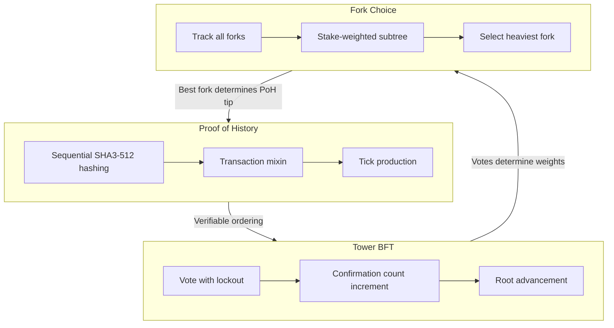
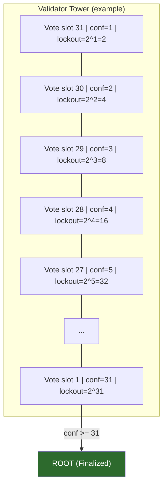
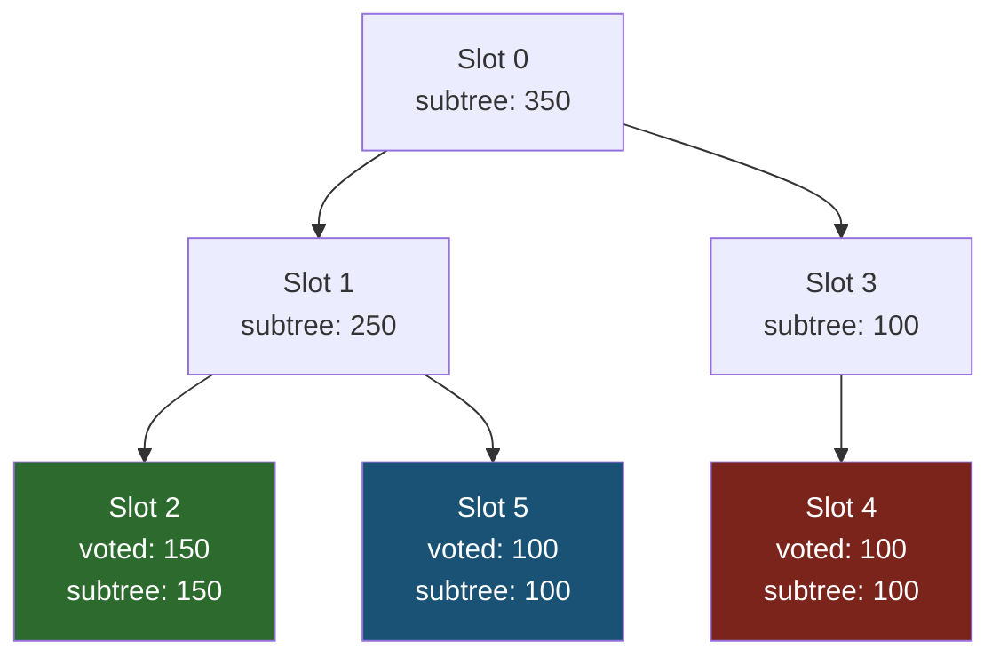
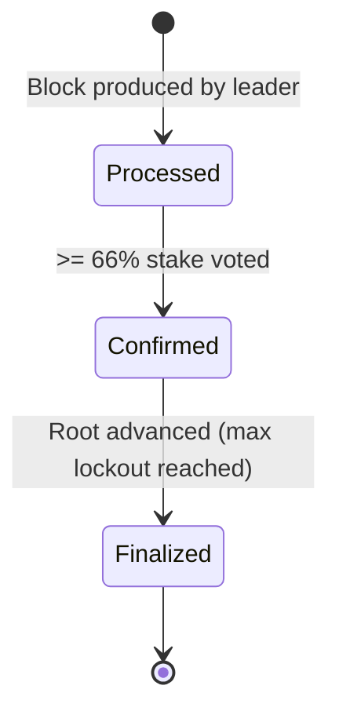

# Consensus

Nusantara's consensus is built on three interlocking mechanisms: Proof of History
(PoH) for verifiable time ordering, Tower BFT for vote-based finality with
exponential lockout, and a fork choice rule based on heaviest subtree stake
weight.

---

## Overview



---

## Proof of History (PoH)

### Purpose

PoH is **not** a consensus mechanism itself. It is a verifiable delay function
(VDF) that provides cryptographic proof of time ordering. Every validator can
independently verify that a specific amount of time passed between two PoH
hashes, enabling Nusantara to order transactions without requiring validators
to communicate about timing.

### Parameters

| Parameter | Value | Description |
|-----------|-------|-------------|
| `hashes_per_tick` | 12,500 | SHA3-512 iterations per tick |
| `ticks_per_slot` | 64 | Ticks per slot |
| `target_tick_duration_us` | 14,062 | Target time per tick (14.062us) |
| Total hashes per slot | 800,000 | 12,500 * 64 |
| Slot duration | 900ms | Wall-clock target |

### Hash Chain

The PoH chain is a sequential application of SHA3-512:

```
h[n+1] = SHA3-512(h[n])           -- pure time passage
h[n+1] = SHA3-512(h[n] || data)   -- data mixin (transaction hash)
```

A **tick** is emitted after every 12,500 hash iterations. A **slot** consists
of 64 ticks with interleaved transaction hash mixins:

```
[--- tick 1 (12500 hashes) ---][tx_mixin][--- tick 2 ---][tx_mixin]...[--- tick 64 ---]
```

The `PohRecorder` maintains the running state and produces entries:

```rust
pub struct PohEntry {
    pub num_hashes: u64,    // Cumulative hash count
    pub hash: Hash,         // Current PoH hash
}

pub struct Tick {
    pub entry: PohEntry,
    pub mixin: Option<Hash>,
}
```

### Verification

PoH verification confirms that the hash chain was computed correctly by replaying
the sequential hashing:

**CPU verification**: `verify_poh_entries()` -- iterate through entries, replaying
hashes and comparing against recorded values. A single mismatch invalidates the
chain.

**CPU chain verification**: `verify_poh_chain()` -- verify a chain with optional
transaction mixins. Returns `Err(PohVerificationFailed { index })` on mismatch.

**GPU verification**: `GpuPohVerifier` parallelizes entry verification across GPU
workgroups using a WGSL compute shader compiled via wgpu:

- Adapter selection: `HighPerformance` preference
- Shader: `poh_verify.wgsl` (included at compile time)
- Each workgroup verifies one entry: 136 bytes input, 4 bytes output
- Automatic CPU fallback when GPU is unavailable or verification fails

The `ReplayStage` uses GPU verification when available:

```rust
let poh_valid = if let Some(ref gpu) = self.gpu_verifier {
    match gpu.verify_batch(&entries) {
        Ok(results) => results.iter().all(|&r| r),
        Err(_) => {
            // Fall back to CPU
            verify_poh_entries(&initial_hash, &entries)
        }
    }
} else {
    verify_poh_entries(&initial_hash, &entries)
};
```

---

## Tower BFT

### Overview

Tower BFT is a vote-based finality mechanism inspired by PBFT but adapted for
Nusantara's PoH-based architecture. Validators vote on blocks, and each vote
carries an exponentially increasing lockout that makes switching forks
progressively more expensive.

### Parameters

| Parameter | Value | Description |
|-----------|-------|-------------|
| `max_lockout_history` | 31 | Maximum number of votes in the tower |
| `vote_threshold_depth` | 8 | Depth at which vote threshold is checked |
| `vote_threshold_percentage` | 66% | Required stake at threshold depth |
| `switch_threshold_percentage` | 38% | Required stake on alternative fork to switch |

### Vote Processing

`Tower::process_vote()` enforces lockout rules through four steps:

1. **Expire old lockouts**: Remove votes whose lockout has expired at the new
   vote's slot. A lockout at slot S with confirmation_count C expires when
   `S + 2^C <= vote_slot`.

2. **Push new lockout**: Add a new `Lockout { slot: vote_slot, confirmation_count: 1 }`
   to the top of the tower.

3. **Increment confirmations**: All existing (non-expired) votes get their
   `confirmation_count` incremented by 1, doubling their lockout period.

4. **Root advancement**: If the bottom vote reaches `MAX_LOCKOUT_HISTORY` (31)
   confirmations, its lockout is 2^31 slots (~24+ years at 900ms slots). This
   vote becomes the new **root** -- an irreversible finality point.

### Lockout Tower Visualization



Each new vote pushes onto the top of the tower. All votes below it get their
confirmation count incremented. When the bottom vote reaches confirmation 31,
it becomes the root and is removed from the tower.

### Lockout Constraints

Before a vote is processed, `check_vote_lockout()` verifies that the new vote
does not violate any existing lockout:

- A vote at slot S is **locked out** until slot `S + 2^confirmation_count`
- You cannot vote for a slot that is **before** a locked-out slot
- Violation returns `ConsensusError::LockoutViolation`

### Switch Threshold

To switch from one fork to another, the alternative fork must have at least
`SWITCH_THRESHOLD_PERCENTAGE` (38%) of total active stake voting for it.
This prevents validators from trivially switching between forks and ensures
network convergence.

```rust
pub fn check_switch_threshold(
    &self,
    _switch_slot: u64,
    voted_stakes: &[(Hash, u64)],
    total_stake: u64,
) -> bool {
    let alternative_stake: u64 = voted_stakes.iter().map(|(_, s)| *s).sum();
    let pct = alternative_stake * 100 / total_stake;
    pct >= SWITCH_THRESHOLD_PERCENTAGE
}
```

### Vote Lifecycle

```
Validator produces/receives block at slot N
    |
    v
process_vote(slot=N)
    |
    +-- Expire lockouts where slot + 2^conf <= N
    +-- Push Lockout { slot: N, conf: 1 }
    +-- Increment conf on all remaining votes
    +-- If bottom vote.conf >= 31 -> ROOT
    |
    v
TowerVoteResult {
    new_root_slot: Option<u64>,
    expired_lockouts: Vec<Lockout>,
    updated_vote_state: VoteState,
}
```

---

## Fork Choice

### Heaviest Subtree Algorithm

The fork choice rule selects the fork with the most cumulative stake weight.
Each validator's tower votes contribute stake to the voted slot, and that
stake propagates upward through the fork tree to the root.

### Fork Tree

The `ForkTree` tracks all known forks as a tree of `ForkNode` entries:

```rust
pub struct ForkNode {
    pub slot: u64,
    pub parent_slot: Option<u64>,
    pub block_hash: Hash,
    pub bank_hash: Hash,
    pub children: Vec<u64>,
    pub stake_voted: u64,       // Direct votes on this slot
    pub subtree_stake: u64,     // Cumulative stake in subtree
    pub is_connected: bool,     // Connected to root
    pub commitment: CommitmentLevel,
}
```

### Parameters

| Parameter | Value | Description |
|-----------|-------|-------------|
| `max_unconfirmed_depth` | 64 | Maximum depth of unconfirmed chain |
| `duplicate_threshold_percentage` | 52% | Stake threshold for duplicate block detection |

### Fork Tree Operations

**add_slot**: Insert a new slot into the tree, linking it to its parent.
Orphan slots (parent not yet in tree) are marked `is_connected = false`.

**add_vote**: When a vote is recorded for a slot, the `stake_voted` on that
node increases, and `subtree_stake` propagates upward through all ancestors
to the root.



In this example, Fork A (slots 0->1->2) has subtree_stake=250, while Fork B
(slots 0->3->4) has subtree_stake=100. The fork choice selects Slot 2 as the
best tip.

**compute_best_fork**: Walk the tree from root, always choosing the child with
the highest `subtree_stake`. Tiebreaker: `block_hash` (deterministic across all
validators, avoiding bias toward any validator's own blocks).

**set_root**: When a slot becomes the finalized root:
1. Collect all slots reachable from the new root
2. Prune all other slots (alternate forks)
3. Update the new root's `parent_slot` to `None`
4. Mark commitment as `Finalized`

**try_reconnect_orphans**: After adding a new slot, iterate orphan nodes and
reconnect any whose parent is now present and connected. Runs in a loop until
no more progress.

### Fork Switch Detection

`ReplayStage::check_fork_switch()` determines if the validator should switch
to a different fork:

1. Compare `best_slot` (heaviest fork tip) with `current_tip`
2. If they differ, find the common ancestor
3. If common ancestor equals current tip, best is a descendant (no switch)
4. Check Tower lockout allows voting on the new fork
5. Verify switch threshold (38% stake on alternative fork)
6. Return a `ForkSwitchPlan` with rollback and replay instructions

```rust
pub struct ForkSwitchPlan {
    pub common_ancestor: u64,
    pub rollback_from: u64,
    pub replay_slots: Vec<u64>,
}
```

---

## Commitment Levels

Transactions and blocks progress through three commitment levels as they
accumulate validator votes.



### Processed

- Block has been produced by the leader and stored in the fork tree
- No votes required
- **Can be reverted** if a heavier fork appears

### Confirmed

- At least `optimistic_confirmation_threshold` (66%) of total active stake
  has voted for this block
- Tracked by `CommitmentTracker::record_vote()`
- **Unlikely to revert** but not guaranteed (theoretical safety violation
  requires > 33% malicious stake)

### Finalized

- The slot has become the Tower BFT root
- Oldest vote reached `MAX_LOCKOUT_HISTORY` (31) confirmations
- `supermajority_threshold` (66%) of stake participated
- Tracked by `CommitmentTracker::mark_finalized()`
- **Irreversible** -- the fork tree is pruned below this point

### CommitmentTracker

The `CommitmentTracker` maintains per-slot commitment state:

```rust
pub struct SlotCommitment {
    pub slot: u64,
    pub block_hash: Hash,
    pub total_stake_voted: u64,
    pub commitment: CommitmentLevel,
}
```

| Method | Description |
|--------|-------------|
| `track_slot(slot, hash)` | Begin tracking at Processed level |
| `record_vote(slot, hash, stake)` | Add stake; upgrade to Confirmed if threshold met |
| `mark_finalized(slot)` | Set to Finalized (called on root advancement) |
| `prune_below(slot)` | Remove entries below the root |

---

## Leader Schedule

### Deterministic Schedule Generation

The leader schedule is computed deterministically per epoch from the genesis
hash (epoch seed) and the current stake distribution. Every validator computes
the same schedule independently.

### Parameters

| Parameter | Value | Description |
|-----------|-------|-------------|
| `num_consecutive_leader_slots` | 4 | Consecutive slots assigned to each leader |
| `slots_per_epoch` | 432,000 | Total slots in one epoch |

### Algorithm

`LeaderScheduleGenerator::compute_schedule()`:

1. Filter validators to those with non-zero stake
2. Sort by identity hash (deterministic ordering regardless of DashMap iteration)
3. Compute a deterministic seed: `hashv([epoch_seed, epoch.to_le_bytes()])`
4. For each assignment (slots_per_epoch / 4 = 108,000 assignments):
   a. Generate deterministic random value from seed + assignment index
   b. Stake-weighted selection: `target = rng_val % total_stake`
   c. Walk cumulative stake to find the selected validator
   d. Assign `NUM_CONSECUTIVE_LEADER_SLOTS` (4) consecutive slots
5. Handle remainder slots (if slots_per_epoch not divisible by 4)

### Schedule Properties

- **Deterministic**: Same inputs always produce the same schedule
- **Stake-weighted**: Validators with more stake get proportionally more leader slots
- **Epoch-scoped**: Different epochs produce different schedules (seeded by epoch number)
- **Cached**: The `ReplayStage` caches computed schedules per epoch

### Schedule Lookup

```rust
// Get leader for a specific slot
schedule.get_leader(slot, &epoch_schedule) -> Option<&Hash>

// Get all slots assigned to a validator
schedule.get_slots_for_validator(&validator, &epoch_schedule) -> Vec<u64>
```

---

## Rewards

### Inflation Model

Nusantara uses a deflationary inflation model that starts high and tapers toward
a terminal rate:

| Parameter | Value | Description |
|-----------|-------|-------------|
| `initial_inflation_rate_bps` | 800 (8%) | Annual inflation rate at epoch 0 |
| `terminal_inflation_rate_bps` | 150 (1.5%) | Minimum annual inflation rate |
| `taper_rate_bps` | 1,500 (15%) | Annual reduction in inflation rate |
| `partition_count` | 4,096 | Reward distribution partitions |

### Taper Curve

Each epoch, the inflation rate is reduced:

```
rate[epoch] = rate[epoch-1] - (rate[epoch-1] * taper_rate / 10000)
if rate < terminal_rate:
    rate = terminal_rate
```

At 900ms slots and 432,000 slots/epoch (~4.5 days), there are approximately
81 epochs per year. The per-epoch reward pool is:

```
epoch_rewards = total_supply * rate_bps / 10000 / epochs_per_year
```

### Reward Calculation

`RewardsCalculator::calculate_epoch_rewards()`:

1. **Calculate points**: For each stake delegation, compute
   `points = epoch_credits * delegation_stake`. Epoch credits come from the
   vote account's `epoch_credits` history.

2. **Compute point value**: `point_value = inflation_rewards * 1,000,000 / total_points`

3. **Calculate individual rewards**: For each delegation:
   - `reward = points * point_value / 1,000,000`
   - `validator_share = reward * commission / 100`
   - `staker_share = reward - validator_share`

4. **Partition rewards**: Each reward entry is assigned to a partition based on
   `hash(stake_account) % PARTITION_COUNT`. This enables distribution across
   multiple slots to avoid concentration.

### Reward Distribution

Rewards are distributed across `PARTITION_COUNT` (4,096) partitions to spread
the load:

```rust
pub struct RewardEntry {
    pub stake_account: Hash,
    pub vote_account: Hash,
    pub lamports: u64,              // Staker reward
    pub commission_lamports: u64,    // Validator commission
    pub post_balance: u64,
    pub commission: u8,
}
```

`RewardDistributionStatus` tracks progress:
- `total_partitions`: 4,096
- `distributed_partitions`: incremented as each partition is applied
- `is_complete()`: all partitions distributed

---

## Slashing

### Double-Vote Detection

The `SlashDetector` monitors gossip votes for equivocation (double-voting):

- Tracks the first vote seen per (validator, slot) pair
- If a second vote for the same (validator, slot) with a **different** block hash
  arrives, a `SlashProof` is produced
- Same vote repeated (identical block hash) is not flagged

```rust
pub struct SlashProof {
    pub validator: Hash,
    pub slot: u64,
    pub vote1_hash: Hash,      // First observed vote
    pub vote2_hash: Hash,      // Conflicting vote
    pub reporter: Hash,        // Validator that detected the equivocation
    pub timestamp: i64,
}
```

### Slash Penalty

| Parameter | Value | Description |
|-----------|-------|-------------|
| `SLASH_PENALTY_BPS` | 500 (5%) | Percentage of delegated stake slashed per equivocation |

Example: A validator with 1,000,000,000 lamports delegated stake that double-votes
receives a penalty of 50,000,000 lamports (5%).

### Slash Registry

The `ConsensusBank` maintains a slash registry (`DashMap<Hash, u64>`) that
accumulates slash penalties per validator:

- `apply_slash(validator, amount)`: Add to the validator's slash total
- `get_slashed_amount(validator)`: Query total slashed lamports
- `get_all_slashes()`: List all (validator, total_slashed) pairs

### Effect on Stake

Slash penalties reduce effective stake at the next epoch boundary:

```rust
// During recalculate_epoch_stakes():
for (validator, stake) in &mut new_stakes {
    let slashed = self.get_slashed_amount(validator);
    if slashed > 0 {
        *stake = stake.saturating_sub(slashed);
    }
}
```

Slash amounts are deducted from the validator's effective stake without modifying
the underlying `Delegation` structs (avoids serialization breakage). A slash
that exceeds the stake amount reduces effective stake to zero (saturating
subtraction).

### Storage

`SlashProof` entries are stored in the `CF_SLASHES` column family in RocksDB
for auditability and cross-validator verification.

### Memory Management

The `SlashDetector` uses `purge_below(min_slot)` to evict old entries and
prevent unbounded memory growth. This is typically called when the root advances.

---

## ReplayStage

The `ReplayStage` is the central orchestrator that ties PoH, Tower BFT, and
fork choice together. It processes incoming blocks from the network and drives
the consensus state machine.

### Block Replay Pipeline

`ReplayStage::replay_block()`:

1. **Verify leader**: Check that the block's `validator` matches the expected
   leader from the cached leader schedule for the epoch.

2. **Verify PoH**: Validate the PoH entry chain (GPU batch or CPU fallback).
   Invalid PoH causes `ConsensusError::PohVerificationFailed`.

3. **Add to fork tree**: Insert the slot into the `ForkTree` with its
   parent_slot, block_hash, and bank_hash.

4. **Process votes**: Extract vote transactions from the block, process each
   through `Tower::process_vote()`. For each successful vote:
   - Add stake-weighted vote to fork tree
   - Update commitment tracker
   - Check for root advancement

5. **Advance bank**: Update `ConsensusBank` slot and slot_hashes sysvar.

6. **Root advancement**: Deferred to the caller (`advance_root()`) to allow
   gating on orphan block considerations.

7. **Compute best fork**: Run heaviest subtree fork choice.

8. **Persist**: Flush frozen bank state to storage.

### Root Advancement

`ReplayStage::advance_root(root)`:

1. Verify the root slot exists in the fork tree
2. `fork_tree.set_root(root)` -- prune all non-descendant branches
3. `commitment_tracker.prune_below(root)` -- discard old commitment entries
4. `bank.set_root(root)` -- mark in storage as finalized

### Gossip Vote Processing

`process_gossip_vote()` handles votes from peer validators received via gossip:

- Adds vote stake to the fork tree
- Updates commitment tracker if the voted slot is in the fork tree
- Does **not** process through Tower (only the local validator's tower matters)

### Async Run Loop

The `ReplayStage::run()` method is the main async event loop:

```rust
loop {
    tokio::select! {
        biased;
        Some((block, poh_entries)) = block_receiver.recv() => {
            // Replay block, advance root if needed
        }
        _ = shutdown.changed() => {
            break;  // Graceful shutdown
        }
    }
}
```

---

## Epoch Boundaries

### Epoch Transition

At every epoch boundary (every 432,000 slots, ~4.5 days):

1. **Recalculate epoch stakes**: `ConsensusBank::recalculate_epoch_stakes()`
   recomputes effective stake for all validators based on:
   - Active delegations (activation_epoch <= epoch < deactivation_epoch)
   - Warmup/cooldown rates (25% per epoch, `warmup_cooldown_rate_bps = 2500`)
   - Slash penalties from the slash registry

2. **Compute leader schedule**: Generate the leader assignment for the next
   epoch using the new stake distribution.

3. **Calculate rewards**: Compute inflation rewards and partition them for
   distribution.

4. **Update stake history**: Record the epoch's effective/activating/deactivating
   stake totals in the `StakeHistory` sysvar.

### Stake Warmup and Cooldown

Newly activated stake warms up at 25% per epoch:
- Epoch of activation: `effective_stake = delegation.stake * 0.25`
- Subsequent epochs: full `delegation.stake`

Deactivating stake cools down similarly:
- Epoch of deactivation: `effective_stake = delegation.stake * 0.75`
- After deactivation: no longer counted

---

## Configuration Reference

All consensus parameters are defined in `consensus/config.toml` and compiled
into constants via `build.rs`:

```toml
[poh]
hashes_per_tick = 12_500
ticks_per_slot = 64
target_tick_duration_us = 14_062

[tower]
vote_threshold_depth = 8
vote_threshold_percentage = 66
switch_threshold_percentage = 38
max_lockout_history = 31

[leader_schedule]
num_consecutive_leader_slots = 4

[fork_choice]
max_unconfirmed_depth = 64
duplicate_threshold_percentage = 52

[commitment]
optimistic_confirmation_threshold = 66
supermajority_threshold = 66

[rewards]
partition_count = 4_096
initial_inflation_rate_bps = 800
terminal_inflation_rate_bps = 150
taper_rate_bps = 1_500
```

---

## Metrics

| Metric | Type | Description |
|--------|------|-------------|
| `poh_hash_iterations_total` | Counter | Total PoH hash iterations performed |
| `poh_records_total` | Counter | Transaction hashes mixed into PoH |
| `poh_ticks_total` | Counter | PoH ticks produced |
| `poh_slots_produced_total` | Counter | PoH slots produced |
| `gpu_verifier_initialized_total` | Counter | GPU verifier initialization events |
| `gpu_poh_entries_verified_total` | Counter | PoH entries verified on GPU |
| `tower_votes_processed_total` | Counter | Votes processed through Tower |
| `tower_roots_advanced_total` | Counter | Root advancement events |
| `fork_tree_node_count` | Gauge | Number of nodes in the fork tree |
| `fork_tree_best_slot` | Gauge | Current best (heaviest) slot |
| `fork_tree_root_slot` | Gauge | Current finalized root slot |
| `commitment_highest_confirmed` | Gauge | Highest confirmed slot |
| `commitment_highest_finalized` | Gauge | Highest finalized slot |
| `replay_blocks_processed_total` | Counter | Blocks replayed by ReplayStage |
| `replay_votes_processed_total` | Counter | Votes processed during replay |
| `leader_schedule_computed_total` | Counter | Leader schedules computed |
| `rewards_epochs_calculated_total` | Counter | Epoch reward calculations |
| `rewards_total_distributed` | Gauge | Total rewards distributed (lamports) |
| `slashing_double_votes_detected` | Counter | Double-vote equivocations detected |
| `slashing_penalties_applied` | Counter | Slash penalties applied |
| `slashing_total_slashed_lamports` | Counter | Total lamports slashed |
| `bank_total_active_stake` | Gauge | Total active stake in current epoch |
| `bank_epoch_stake_validators` | Gauge | Number of validators with active stake |
| `bank_total_supply` | Gauge | Total token supply |
| `bank_current_slot` | Gauge | Current bank slot |
| `bank_slots_frozen_total` | Counter | Slots frozen in consensus bank |
| `state_tree_leaf_count` | Gauge | Number of accounts in state Merkle tree |
