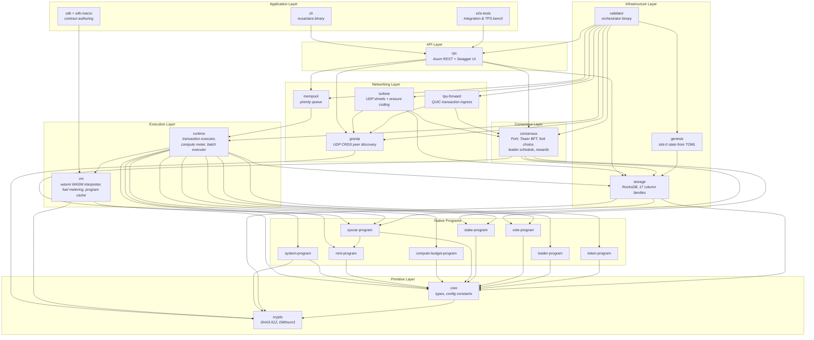
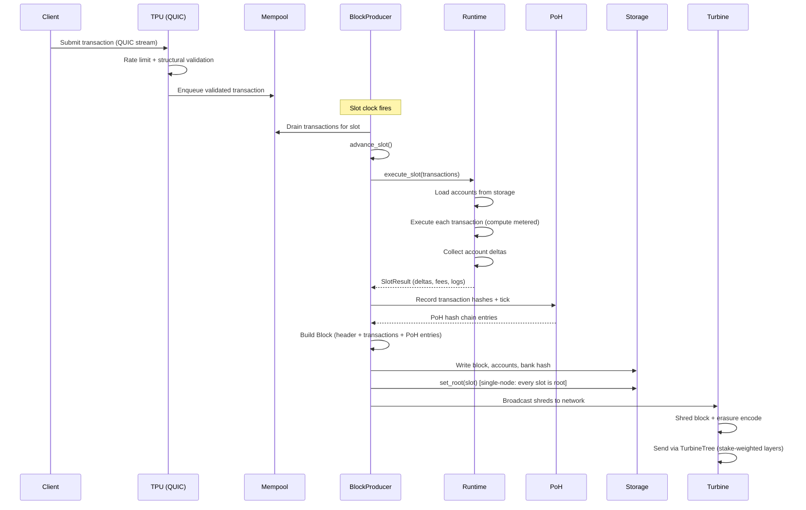
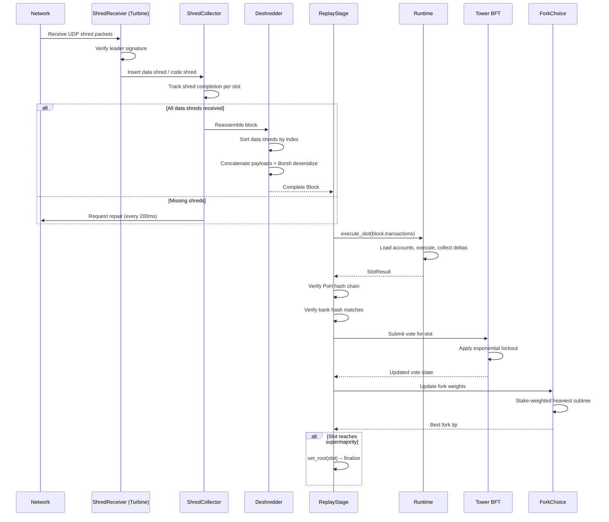

# Nusantara Blockchain -- Architecture Overview

This document describes the design philosophy, system architecture, and key technical
decisions behind the Nusantara blockchain.  It is intended for contributors, auditors,
and integrators who need a high-level map before diving into individual crate READMEs.

---

## Table of Contents

1. [Design Philosophy](#design-philosophy)
2. [System Layer Diagram](#system-layer-diagram)
3. [Layer Breakdown](#layer-breakdown)
4. [Block Production Data Flow](#block-production-data-flow)
5. [Block Replay Data Flow](#block-replay-data-flow)
6. [Key Design Decisions](#key-design-decisions)
7. [Build-Time Configuration Pattern](#build-time-configuration-pattern)
8. [Concurrency Model](#concurrency-model)
9. [Observability](#observability)
10. [Security Considerations](#security-considerations)

---

## Design Philosophy

Nusantara is a high-throughput, post-quantum-secure blockchain inspired by Solana's
architecture but diverging in several fundamental ways:

| Concern | Solana | Nusantara |
|---------|--------|-----------|
| Hash function | SHA-256 (32 bytes) | SHA3-512 (64 bytes) |
| Signature scheme | Ed25519 | Dilithium3 / ML-DSA-65 |
| Smart-contract VM | BPF/SBF (JIT) | WASM (wasmi interpreter, fuel-metered) |
| Serialization | Borsh + bincode | Borsh everywhere (no serde for on-chain data) |
| User-facing encoding | Base58 | Base64 URL-safe no-pad |
| Config delivery | Runtime TOML / env | Build-time `config.toml` + `build.rs` -> `env!()` |

**Core tenets:**

1. **Post-quantum from day one.** Every keypair, signature, and hash uses
   NIST-standardized post-quantum primitives. There is no "migration path" because
   there is nothing to migrate from.

2. **Stateless execution.** The runtime crate has no mutable state of its own.
   It reads accounts from storage, executes a transaction, and returns a set of
   account deltas. All persistence flows through the storage crate.

3. **Deterministic serialization.** Borsh is the only serialization format for data
   that touches consensus. Serde is confined to off-chain config parsing (genesis
   TOML, RPC JSON responses, CLI config).

4. **Zero-cost configuration.** Tunable parameters (slot duration, PoH hashes per
   tick, compute limits, etc.) are resolved at compile time via `config.toml` +
   `build.rs`, producing `env!()` constants with zero runtime overhead.

5. **Safe WASM execution.** Smart contracts compile to WASM and run inside `wasmi`,
   a pure-Rust interpreter with fuel-based metering. No JIT, no `unsafe` in the VM
   boundary, deterministic execution across platforms.

---

## System Layer Diagram



---

## Layer Breakdown

### 1. Primitive Layer

**crypto** -- Post-quantum cryptographic primitives.

- SHA3-512 hashing (64-byte output via the `sha3` crate)
- Dilithium3 (ML-DSA-65) signatures via `pqcrypto-dilithium 0.5`
- Key sizes: PublicKey 1,952 bytes, SecretKey 4,032 bytes, Signature 3,309 bytes
- Account IDs with `.nusantara` suffix and segment validation rules
- Base64 URL-safe no-pad encoding for all user-facing representations
- Manual `BorshSerialize` / `BorshDeserialize` implementations for Hash, PublicKey,
  Signature, and AccountId

**core** -- Shared data structures and compile-time constants.

- `Block`, `BlockHeader`, `Transaction`, `Message`, `Instruction`, `Account`
- Token constants: 1 NUSA = 1,000,000,000 lamports
- Timing: 900 ms slots, 432,000 slots per epoch
- Fee: 5,000 lamports per signature
- Program IDs derived as `LazyLock<Hash>` from hashed string seeds
- Build-time config via `config.toml` + `build.rs`

### 2. Native Programs

Eight built-in programs that execute natively (not in the WASM VM):

| Program | Crate | Purpose |
|---------|-------|---------|
| System | `system-program` | Account creation, transfers, allocations |
| Rent | `rent-program` | Rent calculation, exemption thresholds |
| Compute Budget | `compute-budget-program` | Per-tx compute unit limits and heap size |
| Sysvar | `sysvar-program` | Clock, Rent, SlotHashes, EpochSchedule, etc. |
| Stake | `stake-program` | Stake delegation, activation, withdrawal |
| Vote | `vote-program` | Validator vote accounts and Tower BFT votes |
| Loader | `loader-program` | WASM program deployment and upgrade |
| Token | `token-program` | SPL-style fungible token mints and transfers |

All programs depend on `crypto` + `core` + `borsh` + `thiserror`.
`sysvar-program` additionally depends on `rent-program` for rent sysvar computation.

### 3. Infrastructure Layer

**storage** -- Persistent state backed by RocksDB.

17 column families:

| Column Family | Key Format | Value |
|--------------|------------|-------|
| `default` | variable | Genesis markers, full block blobs |
| `accounts` | address(64) + slot(8 BE) | Borsh-encoded `Account` |
| `account_index` | address(64) | Latest slot (8 BE) |
| `blocks` | slot(8 BE) | Borsh-encoded `BlockHeader` |
| `transactions` | tx_hash(64) | Borsh-encoded `TransactionStatusMeta` |
| `address_signatures` | address(64) + slot(8 BE) + index(4 BE) | tx_hash(64) |
| `slot_meta` | slot(8 BE) | Borsh-encoded `SlotMeta` |
| `data_shreds` | slot(8 BE) + index(4 BE) | Borsh-encoded `DataShred` |
| `code_shreds` | slot(8 BE) + index(4 BE) | Borsh-encoded `CodeShred` |
| `bank_hashes` | slot(8 BE) | Hash(64) |
| `roots` | slot(8 BE) | empty (presence = finalized) |
| `slot_hashes` | slot(8 BE) | Hash(64) |
| `sysvars` | sysvar_id bytes | Borsh-encoded sysvar |
| `snapshots` | slot(8 BE) | Borsh-encoded `SnapshotManifest` |
| `owner_index` | owner(64) + address(64) | empty (prefix scan) |
| `program_index` | program(64) + address(64) | empty (prefix scan) |
| `slashes` | slot(8 BE) + validator(64) | Borsh-encoded slash record |

Fixed-width binary keys (no Borsh length-prefixes) enable efficient range scans.

**genesis** -- Slot-0 state builder.

- Parses `genesis.toml` via serde (the only crate allowed to use serde for config)
- Creates funded accounts, validator vote/stake accounts, sysvars, genesis block
- Idempotent: `GENESIS_HASH_KEY` marker in `CF_DEFAULT` prevents re-initialization
- Genesis hash = `hashv(&[b"nusantara_genesis", cluster_name, creation_time])`

**validator** -- The node binary that orchestrates everything.

- `ValidatorNode::boot()`: opens storage, loads keypair, applies genesis, loads sysvars,
  creates ConsensusBank, registers validators, creates SlotClock and BlockProducer
- `ValidatorNode::run()`: async loop that waits for slot, drains transactions from
  mempool, produces blocks, and checks epoch boundaries
- Graceful shutdown via `tokio::select!` with `ctrl_c`
- Metrics: `blocks_produced`, `current_slot`, `block_time_ms`, `transactions_per_slot`

### 4. Execution Layer

**runtime** -- Stateless transaction execution engine.

- `execute_transaction()` and `execute_slot()` are the primary entry points
- Compute metering with per-instruction budgets
- Fee always deducted from payer even on failure
- `SysvarCache` is immutable per slot
- Account sort order: signed-writable, signed-readonly, unsigned-writable, unsigned-readonly
- No CPI (cross-program invocation for native programs), no BPF/SBF -- sequential execution
- Batch executor uses rayon for Sealevel-style parallel execution of non-conflicting txs

**vm** -- WASM virtual machine for smart contracts.

- `wasmi` interpreter (pure Rust, no JIT, no `unsafe`)
- Fuel-based compute metering (maps 1:1 to compute units)
- LRU program cache (default capacity: 256 programs)
- Configurable limits: 512 KB max bytecode, 64 memory pages, 256 call stack depth,
  4 CPI depth, 1 KB max return data, 10 KB max log message
- Syscall costs defined in `vm/config.toml`: instantiation (10,000 CU),
  SHA3-512 (300 CU), signature verify (2,000 CU), CPI (1,000 CU)

### 5. Consensus Layer

**consensus** -- PoH + Tower BFT + Fork Choice + Leader Schedule + Rewards.

- **Proof of History (PoH)**: sequential SHA3-512 hash chain. 12,500 hashes per tick,
  64 ticks per slot, target tick duration 14,062 us.
- **Tower BFT**: vote-based consensus with exponential lockout. Vote threshold depth 8,
  threshold 66%, switch threshold 38%, max lockout history 31.
- **Fork Choice**: stake-weighted heaviest subtree. Max unconfirmed depth 64,
  duplicate threshold 52%.
- **Leader Schedule**: stake-weighted shuffle, 4 consecutive leader slots per validator.
- **Commitment levels**: Optimistic confirmation at 66% stake, supermajority at 66%.
- **Rewards**: inflation starts at 8.00% APY, tapers 1.50% per year to terminal 1.50%.
  Rewards distributed across 4,096 partitions per epoch.
- GPU-accelerated PoH verification via WGSL compute shader (falls back to CPU).

### 6. Networking Layer

**gossip** -- CRDS-based peer discovery over UDP.

- Push protocol: 100 ms interval, stake-weighted selection of 6 peers, prune support
- Pull protocol: 5 s interval, bloom filter exchange for missing values
- `ContactInfo`: identity, pubkey, 5 socket addresses (gossip, tpu, tpu_forward,
  turbine, repair), shred version, wallclock
- `CrdsTable`: DashMap with monotonic cursor, `values_since(cursor)`, purge at 30 s
- PingCache for liveness with 60 s TTL

**turbine** -- Shred-based block propagation with erasure coding.

- Blocks are Borsh-serialized, split into 1,228-byte data shreds, then FEC-encoded
  in groups of 32 with 33% redundancy (Reed-Solomon GF(2^8))
- `TurbineTree`: stake-weighted deterministic shuffle, fanout 32 per layer
- `ShredCollector`: DashMap per slot, returns `Some(Block)` when all data shreds arrive
- Repair service polls every 200 ms for missing shreds (max 32,768 shreds per slot)

**tpu-forward** -- QUIC-based transaction ingress and leader forwarding.

- Quinn-based QUIC server with self-signed TLS (Dilithium identity verified at app layer)
- Rate limiting: 8 connections per IP, 100 tx/s per IP, 50,000 tx/s global
- Structural transaction validation (no signature verification at ingress)
- If current node is leader, transactions go to local channel; otherwise QUIC-forwarded
  to the leader's TPU address

**mempool** -- Priority-ordered transaction buffer.

- Depends on `runtime` for transaction validation
- Depends on `compute-budget-program` for priority fee extraction
- `parking_lot` mutex for thread-safe access

### 7. API Layer

**rpc** -- Axum REST API with OpenAPI documentation.

- 16 endpoints under `/v1/` covering health, slots, accounts, blocks, transactions,
  epochs, leaders, validators, stake, vote, signatures, and faucet
- Swagger UI at `/swagger-ui/`
- HTTP/2 and WebSocket support (Axum features)
- TLS with rustls, CORS via tower-http
- `RpcState` shared via `Arc<RpcState>` containing storage, consensus bank,
  tx sender channel, leader cache, gossip cluster info, and mempool
- All response types derive `Serialize, Deserialize, ToSchema`
- Faucet: builds system-program transfer from validator identity, max 10 NUSA

### 8. Application Layer

**cli** -- The `nusantara` command-line tool.

- 14 command modules: keygen, balance, transfer, airdrop, account, block, slot,
  transaction, epoch, leader, validators, stake, vote, config
- Config at `~/.config/nusantara/cli.toml` (rpc_url, keypair_path)
- Transaction flow: get blockhash -> build instruction -> `Message::new` -> sign ->
  Borsh serialize -> Base64 encode -> POST to RPC

**sdk + sdk-macro** -- Smart contract authoring toolkit.

- `sdk`: re-exports Borsh, provides PDA derivation (SHA3-512 on native, syscall on WASM)
- `sdk-macro`: proc-macro crate using `proc-macro2`, `quote`, `syn` for derive macros
- No internal crate dependencies (standalone for contract authors)

**e2e-tests** -- End-to-end integration tests and TPS benchmark binary.

---

## Block Production Data Flow



---

## Block Replay Data Flow



---

## Key Design Decisions

### SHA3-512

- **Why not SHA-256?** SHA-256 offers only 128-bit post-quantum security (Grover's
  algorithm). SHA3-512 provides 256-bit post-quantum security, matching the security
  level of Dilithium3.
- **Trade-off:** 64-byte hashes double storage and bandwidth compared to 32-byte hashes.
  This is acceptable for a chain designed to last decades.
- **NIST standard:** SHA3 (FIPS 202) is a distinct construction (Keccak sponge) from
  SHA-2, providing algorithm diversity.

### Dilithium3 (ML-DSA-65)

- **Why not Ed25519?** Ed25519 is broken by a sufficiently large quantum computer.
  Dilithium3 is the NIST Post-Quantum Cryptography standard (FIPS 204).
- **Size impact:** Public keys are 1,952 bytes (vs. 32 for Ed25519), signatures are
  3,309 bytes (vs. 64). This increases transaction size significantly but is the
  minimum cost of post-quantum security at NIST Level 3.
- **Performance:** Dilithium3 signing and verification are slower than Ed25519 but
  still practical for blockchain throughput targets.

### Borsh Serialization

- **Deterministic:** Given the same Rust struct, Borsh always produces the same bytes.
  This is critical for consensus -- two validators must compute identical hashes.
- **No schema evolution:** Chain data is append-only. Old formats are never reinterpreted.
  If a struct changes, a new column family or migration slot is introduced.
- **No serde for on-chain data:** Serde is powerful but non-deterministic across
  implementations. Borsh is used everywhere except genesis TOML parsing and RPC JSON.

### Base64 URL-Safe No-Pad Encoding

- **Compact:** ~33% overhead vs. ~37% for hex, ~36% for Base58.
- **URL-safe:** No `+` or `/` characters; safe in URLs, filenames, and JSON without escaping.
- **Standard:** RFC 4648 Section 5. Every language has a native implementation.
- **No pad:** Trailing `=` characters are omitted -- length is implicit from the data.

### wasmi WASM Interpreter

- **Safety:** Pure-Rust interpreter with no JIT compilation and no `unsafe` in the
  execution path. Deterministic across all platforms.
- **Fuel metering:** Maps directly to compute units. Each WASM instruction consumes
  fuel; when fuel runs out, execution halts with an error.
- **LRU cache:** Compiled WASM modules are cached (capacity 256) to avoid repeated
  parsing for hot programs.
- **Why not wasmtime/wasmer?** JIT compilers introduce non-determinism across CPU
  architectures and compiler versions. For consensus, determinism is paramount.

### Build-Time Configuration

Eleven crates use the `config.toml` + `build.rs` pattern:

```
core/           consensus/      gossip/        turbine/
tpu-forward/    vm/             mempool/       rent-program/
compute-budget-program/         stake-program/ vote-program/
```

**How it works:**

1. Each crate has a `config.toml` with human-readable parameters.
2. `build.rs` reads the TOML at compile time, strips underscores from numeric values,
   and emits `cargo:rustc-env=NUSA_PARAM_NAME=value` directives.
3. Source code reads these with `env!("NUSA_PARAM_NAME")` and parses them with
   `const_parse_u64()` for zero-runtime-overhead constants.

**Benefits:**
- Type-safe at compile time (invalid values break the build, not the runtime).
- No config file loading, no environment variable parsing at startup.
- Parameters are baked into the binary, eliminating an entire class of misconfiguration.
- Changing a parameter requires recompilation, which ensures all crates agree.

---

## Concurrency Model

Nusantara uses a layered concurrency strategy:

### Tokio (async I/O)

All network-bound and timer-bound work runs on the Tokio runtime:

- **Validator main loop:** `tokio::select!` over slot clock and `ctrl_c`
- **Gossip service:** 4 spawned tasks (recv, push, pull, purge)
- **TPU QUIC server:** Quinn endpoints on Tokio UDP sockets
- **RPC server:** Axum HTTP server on Tokio TCP
- **Turbine:** Shred broadcast and retransmit as async tasks

### DashMap (concurrent hash maps)

Lock-free concurrent maps for hot shared state:

- `CrdsTable` in gossip (peer contact info, votes, epoch slots)
- `ShredCollector` in turbine (per-slot shred tracking)
- `ConnectionCache` in TPU (QUIC connection pool)

### parking_lot (low-level mutual exclusion)

Faster-than-std mutexes and read-write locks for fine-grained state:

- Consensus bank state (slot, bank hash, vote/stake snapshots)
- Mempool transaction buffer
- TPU rate limiter counters

### rayon (data parallelism)

CPU-bound parallel work:

- Batch transaction execution (Sealevel-style: non-conflicting transactions in parallel)
- Used by the runtime crate's `batch_executor` module

### wgpu (GPU compute)

Optional GPU acceleration:

- PoH verification via WGSL compute shader (SHA3-512 hash chain replay)
- Transparent CPU fallback if no GPU adapter is available

---

## Observability

### Metrics

The `metrics` crate (v0.24) is used throughout the stack with Prometheus export:

- **Validator:** `blocks_produced`, `current_slot`, `block_time_ms`, `transactions_per_slot`
- **Consensus:** PoH hash rate, Tower vote count, fork depth, reward distribution time
- **Runtime:** CU consumed per slot, transaction success/failure counts
- **Storage:** RocksDB read/write latency, column family sizes
- **Networking:** gossip push/pull counts, shred loss rate, QUIC connection count,
  mempool depth

Prometheus exporter is initialized in the validator binary via `metrics-exporter-prometheus`.

### Tracing

Structured logging via `tracing` + `tracing-subscriber` with `env-filter`:

```bash
RUST_LOG=info,nusantara_consensus=debug,nusantara_runtime=trace \
    nusantara-validator --ledger-path /data
```

Key instrumented spans:
- `#[tracing::instrument]` on block production, transaction execution, PoH generation
- Slot-scoped spans for correlating all activity within a slot

---

## Security Considerations

### Post-Quantum Threat Model

- All on-chain signatures use Dilithium3 (NIST Level 3, ~128-bit classical / ~128-bit
  quantum security).
- Hash function SHA3-512 provides 256-bit pre-image resistance even under Grover's
  algorithm.
- TLS between nodes uses standard rustls, but node identity is verified at the application
  layer using Dilithium signatures (the `SkipServerVerification` pattern in TPU).

### Execution Safety

- WASM VM is interpreted (no JIT) to eliminate code-generation attacks.
- Fuel metering prevents infinite loops and resource exhaustion.
- CPI depth is capped at 4 to limit re-entrancy.
- Max bytecode size (512 KB) and memory pages (64) bound resource consumption.

### Network Rate Limiting

- Per-IP connection limit (8) prevents connection exhaustion.
- Per-IP transaction rate (100/s) and global rate (50,000/s) prevent spam.
- Structural validation at ingress rejects malformed transactions before they reach
  the mempool.

### Storage Integrity

- All storage keys use fixed-width binary encoding (no length-prefix ambiguity).
- Genesis is idempotent (marker key prevents re-initialization).
- `StorageWriteBatch` provides atomic multi-column-family writes.
- Account history is preserved for auditability (`get_account_at_slot`).
- Slot pruning is controlled: account data is retained even when block data is purged.

---

## Appendix: Crate Summary

| Crate | Binary | Category | Key External Deps |
|-------|--------|----------|-------------------|
| `crypto` | -- | Primitive | sha3, pqcrypto-dilithium, base64 |
| `core` | -- | Primitive | borsh |
| `system-program` | -- | Program | borsh |
| `rent-program` | -- | Program | borsh |
| `compute-budget-program` | -- | Program | borsh |
| `sysvar-program` | -- | Program | borsh |
| `stake-program` | -- | Program | borsh |
| `vote-program` | -- | Program | borsh |
| `loader-program` | -- | Program | borsh |
| `token-program` | -- | Program | borsh |
| `storage` | -- | Infrastructure | rocksdb |
| `consensus` | -- | Consensus | wgpu, dashmap, parking_lot |
| `runtime` | -- | Execution | rayon |
| `vm` | -- | Execution | wasmi, lru |
| `genesis` | -- | Infrastructure | serde, toml |
| `gossip` | -- | Networking | dashmap, parking_lot, rand |
| `turbine` | -- | Networking | reed-solomon-erasure, dashmap |
| `tpu-forward` | -- | Networking | quinn, rustls, rcgen |
| `mempool` | -- | Networking | parking_lot |
| `rpc` | -- | API | axum, utoipa, tower-http, rustls |
| `validator` | `nusantara-validator` | Infrastructure | clap, metrics-exporter-prometheus |
| `cli` | `nusantara` | Application | clap, reqwest, dirs |
| `sdk` | -- | Application | borsh, sha3 (native only) |
| `sdk-macro` | -- | Application | proc-macro2, quote, syn |
| `e2e-tests` | `tps-bench` | Testing | reqwest, clap, rand |

---

*Last updated: 2026-03-17*
