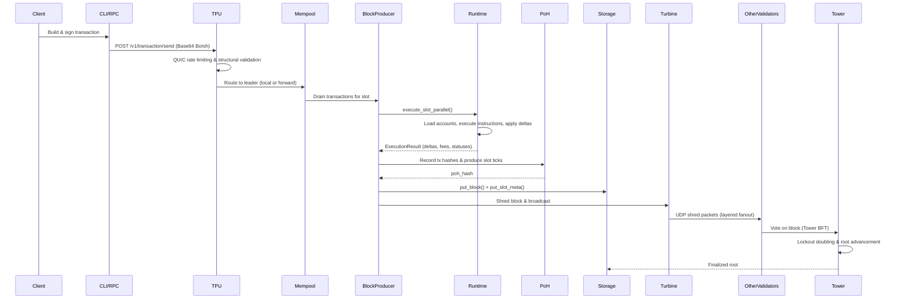
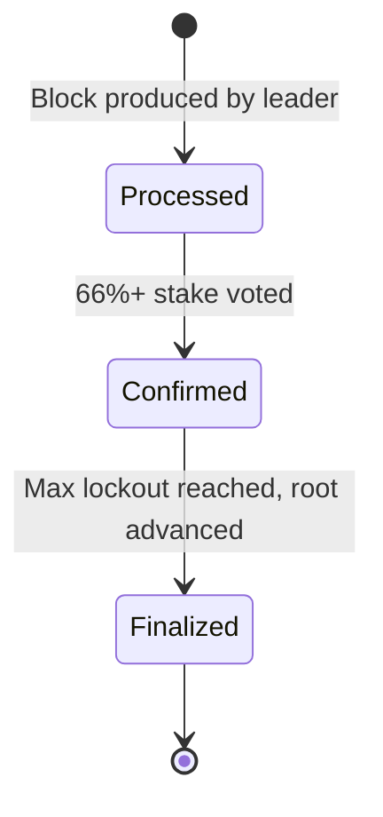

# Transaction Lifecycle

End-to-end documentation of how a transaction flows through the Nusantara blockchain,
from client construction to finalized confirmation.

## Overview



---

## Phase 1: Construction

The client builds, signs, serializes, and submits a transaction.

### 1.1 Fetch Latest Blockhash

The CLI (or any client) retrieves the most recent blockhash to anchor the
transaction's lifetime window:

```
GET /v1/blockhash
```

The blockhash is returned as a Base64 URL-safe no-pad string. Transactions
referencing an expired blockhash are rejected at the runtime layer.

### 1.2 Build Instructions

Each instruction specifies:

| Field | Description |
|-------|-------------|
| `program_id` | Hash identifying the on-chain program to invoke |
| `accounts` | Ordered list of `AccountMeta` (address, is_signer, is_writable) |
| `data` | Borsh-serialized instruction payload |

### 1.3 Compose the Message

`Message::new()` assembles instructions into a transaction message. Accounts are
deduplicated and sorted into four sections by their access flags:

1. **Signed + Writable** (payer is always first)
2. **Signed + Read-only**
3. **Unsigned + Writable**
4. **Unsigned + Read-only**

This ordering is required for the `is_writable()` positional logic in the
runtime. The first account is always the fee payer.

### 1.4 Sign

The message is signed with the payer's **Dilithium3 (ML-DSA-65)** post-quantum
keypair. Multiple signers are supported when the message requires them.

Key sizes:
- Public key: 1,952 bytes
- Secret key: 4,032 bytes
- Signature: 3,309 bytes

### 1.5 Serialize and Submit

The signed `Transaction` is serialized to Borsh bytes, then encoded as
**Base64 URL-safe no-pad** for transport:

```
POST /v1/transaction/send
Content-Type: application/json

{
  "transaction": "<base64-borsh-encoded-transaction>"
}
```

The RPC handler (`send_transaction`) decodes the Base64, deserializes the Borsh
bytes into a `Transaction`, inserts it into the mempool, and optionally forwards
it via the TPU path.

The response returns the transaction hash (Base64):

```json
{
  "signature": "<base64-transaction-hash>"
}
```

---

## Phase 2: Ingress (TPU)

The Transaction Processing Unit handles QUIC-based transaction ingress with
rate limiting and leader routing.

### 2.1 QUIC Connection

Clients connect to the validator's TPU port via QUIC (quinn). The connection
is subject to per-IP limits:

| Parameter | Value |
|-----------|-------|
| `max_connections_per_ip` | 8 |
| `max_tx_per_second_per_ip` | 100 |
| `max_tx_per_second_global` | 50,000 |
| `max_transaction_size` | 65,536 bytes |
| `quic_max_concurrent_streams` | 1,024 |

TLS certificates are self-signed; identity verification happens at the
application layer via Dilithium signatures, not TLS (`SkipServerVerification`).

### 2.2 Wire Protocol

Transactions arrive as `TpuMessage` variants, Borsh-serialized:

- `TpuMessage::Transaction` -- single transaction
- `TpuMessage::TransactionBatch` -- batch of transactions

### 2.3 Structural Validation

The `TxValidator` performs lightweight structural checks on incoming
transactions. Signature verification is **not** performed at this stage to
maximize throughput. Invalid structures are rejected with a metric bump
(`tpu_invalid_transactions_total`).

### 2.4 Leader Routing

The `TransactionForwarder` determines where to send valid transactions:

- **This validator is leader**: transactions are sent to the local mempool
  channel for the `BlockProducer`.
- **Another validator is leader**: transactions are forwarded over QUIC to the
  leader's TPU address.

Forwarding parameters:
- `forward_batch_size`: 64 transactions per flush
- `forward_interval_ms`: 10ms flush interval

---

## Phase 3: Inclusion

The `BlockProducer` drains the mempool and produces a block for each slot.

### 3.1 Slot Timing

The `SlotClock` determines the current slot from wall-clock time:

```
current_slot = (now_ms - genesis_creation_time_ms) / slot_duration_ms
```

| Parameter | Value |
|-----------|-------|
| `slot_duration_ms` | 900 |
| `slots_per_epoch` | 432,000 |
| Epoch duration | ~4.5 days |

### 3.2 Block Production Pipeline

`BlockProducer::produce_block()` executes the following steps for each slot:

1. **advance_slot()** -- update Clock sysvar (slot, epoch, timestamp)
2. **Build SysvarCache** -- snapshot Clock, Rent, EpochSchedule, SlotHashes,
   StakeHistory, RecentBlockhashes
3. **execute_slot_parallel()** -- Sealevel-style parallel execution of all
   transactions in the slot
4. **update_state_tree()** -- update incremental Merkle tree with account deltas
5. **Record tx hashes in PoH** -- `poh.record(&tx.hash())` for each transaction
6. **produce_slot()** -- grind 64 PoH ticks (800,000 total hashes)
7. **Compute merkle_root** -- MerkleTree of all transaction hashes
8. **Compute block_hash** -- `hashv([parent_hash, slot_le_bytes, poh_hash])`
9. **freeze()** -- compute bank_hash, lock state
10. **Assemble Block** -- BlockHeader + transactions
11. **put_block()** -- persist to RocksDB
12. **put_slot_meta()** -- store slot metadata
13. **record_slot_hash()** -- update consensus bank's SlotHashes sysvar
14. **flush_to_storage()** -- persist frozen bank state (bank_hash, slot_hash)
15. **Tower BFT root advancement** -- handled by ReplayStage
16. **Update parent pointers** -- advance parent_slot/parent_hash, reset PoH

### 3.3 Compute Budget

Each transaction has a compute budget parsed from its instructions:

- **Default**: 200,000 compute units
- Programs can request a custom budget via ComputeBudget instructions
- `loaded_accounts_data_size_limit` caps account data loaded per transaction

### 3.4 Runtime Execution

The runtime (`execute_transaction`) processes each transaction:

1. **Verify signatures** -- Dilithium3 signature verification
2. **Parse compute budget** -- extract CU limit from instructions
3. **Calculate fee** -- `lamports_per_signature` (5,000) * number of signatures
4. **Load accounts** -- read account state from storage
5. **Execute instructions** -- dispatch to native program processors
6. **Apply deltas** -- write modified account state
7. **Deduct fee** -- always deducted from payer, even on failure

### 3.5 Fee Deduction Rules

| Scenario | Fee Deducted? | State Changes? |
|----------|---------------|----------------|
| Success | Yes | Applied |
| Failed (runtime error) | Yes | Reverted (only payer balance delta kept) |
| Invalid signature | No (rejected at runtime step 1) | None |
| Expired blockhash | No (rejected at runtime) | None |

On failure, the payer's balance delta is constructed directly (fee deduction
only) rather than comparing pre/post states. All other account changes from the
failed transaction are discarded.

### 3.6 Transaction Status

Each transaction's result is stored in RocksDB with status metadata:

- `TransactionStatus::Success` -- all instructions executed without error
- `TransactionStatus::Failed(msg)` -- execution error with description

Query status via:

```
GET /v1/transaction/{hash}
```

Response includes slot, status, fee, pre/post balances, and compute units consumed.

---

## Phase 4: Propagation

After block production, the block is shredded and broadcast to the network.

### 4.1 Shredding

The `Shredder` breaks the block into erasure-coded shreds for network transport:

1. Borsh-serialize the `Block` into bytes
2. Split into 1,228-byte data chunks -> `DataShred[]`
3. FEC encode in groups of 32 -> `CodeShred[]` (33% redundancy)
4. Sign each shred with the leader's Dilithium keypair

| Parameter | Value |
|-----------|-------|
| `max_data_per_shred` | 1,228 bytes |
| `fec_rate_percent` | 33% |
| `max_shreds_per_slot` | 32,768 |
| Reed-Solomon backend | galois_8 |

### 4.2 Turbine Tree

The `TurbineTree` determines the broadcast topology:

- Stake-weighted deterministic shuffle per slot
- **Fanout**: 32 peers per layer
- Leader broadcasts to layer-0 nodes
- Layer-0 retransmits to layer-1, and so on
- UDP shred packets to peer addresses resolved via gossip `ClusterInfo`

### 4.3 Repair

If a validator is missing shreds, the `RepairService` requests them:

- `repair_interval_ms`: 200ms polling interval
- `max_repair_batch_request`: 256 shreds per request
- `max_shreds_per_repair_response`: 14 shreds per response

### 4.4 Deshredding

Receiving validators reassemble the block:

1. Collect `DataShred[]` (with FEC recovery from `CodeShred[]` if needed)
2. Sort by index, concatenate data
3. Borsh-deserialize into `Block`

---

## Phase 5: Confirmation

Validators vote on blocks using Tower BFT to achieve finality.

### 5.1 Block Replay

The `ReplayStage` processes received blocks:

1. Verify leader matches the expected schedule
2. Verify PoH entries (GPU batch or CPU fallback)
3. Add slot to fork tree
4. Extract vote transactions and process through Tower
5. Advance bank slot and record slot hash
6. Compute best fork (heaviest subtree)
7. Freeze bank state and persist

### 5.2 Tower BFT Voting

Validators cast votes with exponential lockout:

- **Max tower depth**: 31 votes (`max_lockout_history`)
- **Lockout doubling**: vote at depth d has lockout of 2^d slots
- **Vote threshold**: 66% stake at depth 8 (`vote_threshold_depth`)
- **Switch threshold**: 38% stake on alternative fork required to switch

### 5.3 Commitment Levels

Transactions progress through three commitment levels:



| Level | Criteria | Reversibility |
|-------|----------|---------------|
| **Processed** | Block produced by leader | Can be reverted (fork switch) |
| **Confirmed** | >= 66% of active stake voted (`optimistic_confirmation_threshold`) | Unlikely to revert |
| **Finalized** | Root slot advanced (oldest vote exceeds 2^31 lockout), 66% supermajority (`supermajority_threshold`) | Irreversible |

### 5.4 Root Advancement

When the oldest vote in a validator's tower reaches `MAX_LOCKOUT_HISTORY` (31)
confirmations, the lockout exceeds 2^31 slots. That vote's slot becomes the
new **root**:

- The fork tree prunes all branches not descending from the root
- The commitment tracker marks the slot as `Finalized`
- Storage marks the slot as the finalized root
- All transactions in the root slot and its ancestors are irreversible

---

## Transaction Lifecycle Summary

```
Client                TPU                BlockProducer       Network
  |                    |                      |                 |
  |-- sign + send ---->|                      |                 |
  |                    |-- rate limit -------->|                 |
  |                    |-- validate struct --->|                 |
  |                    |                      |                 |
  |                    |    (if leader)        |                 |
  |                    |-- local channel ----->|                 |
  |                    |    (if not leader)    |                 |
  |                    |-- QUIC forward ------>| (remote leader) |
  |                    |                      |                 |
  |                    |                      |-- execute ------>|
  |                    |                      |-- PoH record --->|
  |                    |                      |-- shred -------->|
  |                    |                      |                 |-- turbine broadcast
  |                    |                      |                 |-- vote (Tower BFT)
  |                    |                      |                 |-- root advancement
  |                    |                      |                 |
  |<------------ query status (Processed/Confirmed/Finalized) -|
```

---

## Error Handling

### Client-Side Errors

| Error | Cause | Resolution |
|-------|-------|------------|
| Invalid base64 | Malformed encoding | Re-encode transaction |
| Invalid transaction | Borsh deserialization failed | Rebuild transaction |
| Mempool rejected | Duplicate or malformed | Check transaction structure |

### TPU-Level Rejections

| Error | Cause | Resolution |
|-------|-------|------------|
| Connection limit exceeded | > 8 connections from same IP | Reduce connection count |
| Rate limited | > 100 tx/s from same IP | Throttle submission rate |
| Structural validation failed | Missing required fields | Fix transaction structure |

### Runtime-Level Failures

| Error | Fee Charged? | Resolution |
|-------|-------------|------------|
| Signature verification failed | No | Fix keypair / signing |
| Account not found | Yes | Fund or create account |
| Insufficient funds | Yes (if payer has enough for fee) | Add funds to payer |
| Compute budget exceeded | Yes | Increase compute budget |
| Program error | Yes | Debug program logic |
| Blockhash expired | No | Fetch fresh blockhash |

---

## Metrics

Key metrics emitted during the transaction lifecycle:

| Metric | Type | Description |
|--------|------|-------------|
| `rpc_transactions_submitted` | Counter | Transactions received via RPC |
| `tpu_transactions_received_total` | Counter | Transactions received via TPU QUIC |
| `tpu_invalid_transactions_total` | Counter | Structurally invalid transactions |
| `tpu_local_forward_total` | Counter | Batches forwarded to local block producer |
| `tpu_remote_forward_total` | Counter | Batches forwarded to remote leader |
| `nusantara_blocks_produced` | Counter | Total blocks produced |
| `nusantara_block_time_ms` | Histogram | Block production time |
| `nusantara_transactions_per_slot` | Gauge | Transactions in the latest slot |
| `nusantara_current_slot` | Gauge | Current slot number |
| `replay_blocks_processed_total` | Counter | Blocks replayed by ReplayStage |
| `tower_votes_processed_total` | Counter | Tower votes processed |
| `tower_roots_advanced_total` | Counter | Root advancement events |
| `commitment_highest_confirmed` | Gauge | Highest confirmed slot |
| `commitment_highest_finalized` | Gauge | Highest finalized slot |
