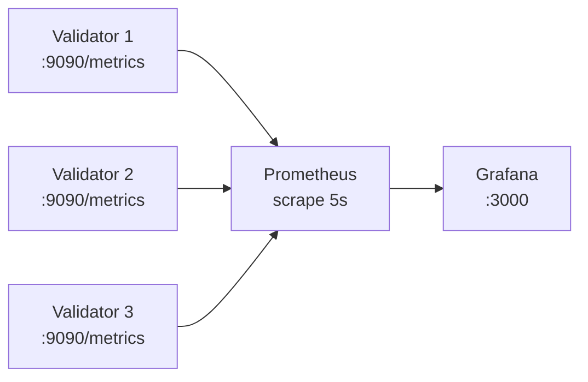

# Monitoring and Metrics

This document describes the metrics exported by Nusantara validators, Prometheus
configuration, Grafana dashboards, and alerting recommendations.

## Metrics Stack



Each validator exposes a Prometheus-compatible `/metrics` endpoint on port 9090. Prometheus
scrapes all validators and stores time-series data. Grafana queries Prometheus for
visualization and alerting.

## Prometheus Configuration

```yaml
global:
  scrape_interval: 5s
  evaluation_interval: 5s

scrape_configs:
  - job_name: "nusantara-validator-1"
    static_configs:
      - targets: ["validator-1:9090"]
        labels:
          validator: "1"

  - job_name: "nusantara-validator-2"
    static_configs:
      - targets: ["validator-2:9090"]
        labels:
          validator: "2"

  - job_name: "nusantara-validator-3"
    static_configs:
      - targets: ["validator-3:9090"]
        labels:
          validator: "3"
```

The 5-second scrape interval aligns with Nusantara's slot time characteristics. Each
validator is configured as a separate job to allow per-validator filtering in Grafana.

## Key Metrics Catalog

### Validator Metrics

Core metrics emitted by the validator binary.

| Metric | Type | Description |
|--------|------|-------------|
| `nusantara_blocks_produced` | counter | Total blocks produced by this validator |
| `nusantara_parallel_execution_blocks` | counter | Blocks executed with parallel transaction processing |
| `nusantara_current_slot` | gauge | Current slot number the validator is processing |
| `nusantara_block_time_ms` | histogram | Time to produce a block (milliseconds) |
| `nusantara_transactions_per_slot` | gauge | Number of transactions in the last produced block |
| `nusantara_state_tree_leaves` | gauge | Number of leaves in the state Merkle tree |

### Consensus Metrics

Metrics from the Tower BFT consensus and fork choice engine.

| Metric | Type | Description |
|--------|------|-------------|
| `nusantara_tower_height` | gauge | Current height of the Tower vote stack |
| `nusantara_fork_count` | gauge | Number of known forks being tracked |
| `nusantara_root_slot` | gauge | Latest finalized (rooted) slot |

### Network Metrics

Metrics from the gossip, turbine, and TPU subsystems.

| Metric | Type | Description |
|--------|------|-------------|
| `nusantara_gossip_push_messages` | counter | Gossip push messages sent to peers |
| `nusantara_gossip_pull_requests` | counter | Gossip pull requests initiated |
| `nusantara_turbine_shreds_sent` | counter | Data and code shreds broadcast |
| `nusantara_turbine_shreds_received` | counter | Shreds received from the network |
| `nusantara_tpu_transactions_received` | counter | Transactions received via TPU QUIC |

### RPC Metrics

Metrics from the Axum-based RPC server.

| Metric | Type | Description |
|--------|------|-------------|
| `nusantara_rpc_server_started` | counter | Number of times the RPC server has started |
| `rpc_jsonrpc_requests` | counter | Total JSON-RPC requests served |
| `rpc_jsonrpc_transactions_submitted` | counter | Transactions submitted via RPC |
| `rpc_jsonrpc_batch_requests` | counter | Batch RPC requests received |
| `rpc_jsonrpc_batch_size` | histogram | Number of sub-requests per batch |
| `rpc_ws_upgrades` | counter | WebSocket upgrade requests |
| `rpc_ws_active_connections` | gauge | Currently active WebSocket connections |
| `rpc_ws_events_sent` | counter | Events delivered to WebSocket subscribers |
| `rpc_ws_events_lagged` | counter | Events dropped due to slow subscribers |
| `rpc_ws_subscriptions` | counter | Total WebSocket subscription requests |

## Grafana Setup

### Access

| Setting | Value |
|---------|-------|
| URL | `http://localhost:3000` |
| Username | `admin` |
| Password | `nusantara` |
| Anonymous access | Enabled (read-only) |

### Pre-Provisioned Resources

The Docker Compose deployment automatically provisions:

- **Datasource**: Prometheus at `http://prometheus:9090`
- **Dashboard**: `nusantara.json` with panels for all metric categories

The provisioning files are located in `docker/grafana/provisioning/`.

### Dashboard Panels

The pre-built dashboard includes the following panels:

**Overview Row**
- Current slot (per validator)
- Blocks produced (rate, per validator)
- Root slot (per validator)
- Transactions per slot (per validator)

**Consensus Row**
- Tower height (per validator)
- Fork count (per validator)
- Block production time (p50, p95, p99)

**Network Row**
- Gossip push rate
- Gossip pull rate
- Shreds sent/received rate
- TPU transaction ingress rate

**RPC Row**
- Request rate
- Active WebSocket connections
- WebSocket events sent vs lagged
- Transaction submission rate

## Alerting Recommendations

The following PromQL expressions can be used with Prometheus Alertmanager or Grafana
alerting to detect common operational issues.

### No Blocks Produced

Fires when a validator stops producing blocks for 30 seconds.

```promql
rate(nusantara_blocks_produced[30s]) == 0
```

**Severity**: P0 -- indicates validator is stalled or crashed.

### Slot Drift

Fires when the validator's current slot falls behind expected wall-clock slot by more
than 10 slots.

```promql
nusantara_current_slot < (time() - nusantara_genesis_time) / 0.9
```

**Severity**: P1 -- validator is falling behind the cluster.

### High Block Production Time

Fires when the 99th percentile block production time exceeds 800ms (slot time is 400ms,
so this leaves very little margin).

```promql
histogram_quantile(0.99, rate(nusantara_block_time_ms_bucket[5m])) > 800
```

**Severity**: P1 -- validator may start skipping slots.

### WebSocket Client Lagging

Fires when WebSocket events are being dropped due to slow subscribers.

```promql
rate(rpc_ws_events_lagged[5m]) > 0
```

**Severity**: P2 -- clients are missing real-time updates.

### RPC Server Down

Fires when Prometheus cannot scrape a validator's metrics endpoint.

```promql
up{job=~"nusantara-validator.*"} == 0
```

**Severity**: P0 -- validator is unreachable.

### High Fork Count

Fires when the number of tracked forks exceeds a threshold, which may indicate network
partitioning.

```promql
nusantara_fork_count > 10
```

**Severity**: P2 -- investigate network connectivity between validators.

### TPU Ingress Drop

Fires when TPU transaction ingress drops to zero, indicating clients cannot submit
transactions.

```promql
rate(nusantara_tpu_transactions_received[1m]) == 0
```

**Severity**: P1 -- transaction submission is broken.

## Useful PromQL Queries

### Block Production Rate (blocks per minute)

```promql
rate(nusantara_blocks_produced[1m]) * 60
```

### Average Transactions per Block (5-minute window)

```promql
avg_over_time(nusantara_transactions_per_slot[5m])
```

### Gossip Message Rate (push + pull combined)

```promql
rate(nusantara_gossip_push_messages[5m]) + rate(nusantara_gossip_pull_requests[5m])
```

### RPC Request Rate by Validator

```promql
rate(rpc_jsonrpc_requests[5m])
```

### WebSocket Connection Churn

```promql
rate(rpc_ws_upgrades[5m])
```

## Operational Procedures

### Verifying Metrics Endpoint

```bash
# Check that the metrics endpoint is responding
curl -s http://localhost:9090/metrics | head -20

# Check a specific metric
curl -s http://localhost:9090/metrics | grep nusantara_current_slot
```

### Checking Prometheus Targets

Open `http://localhost:9090/targets` in a browser to verify all scrape targets are in
the `UP` state.

### Grafana Dashboard Import

If the pre-provisioned dashboard is not available, import manually:

1. Navigate to Grafana > Dashboards > Import
2. Upload `docker/grafana/dashboards/nusantara.json`
3. Select the Prometheus datasource
4. Save

### Log Correlation

Validators emit structured logs via `tracing` with `tracing-subscriber` and `env-filter`.
Set the `RUST_LOG` environment variable to control verbosity:

```bash
# Default: info level
RUST_LOG=info

# Debug level for Nusantara crates only
RUST_LOG=info,nusantara=debug

# Trace level for consensus module
RUST_LOG=info,nusantara_consensus=trace

# Debug everything (very verbose)
RUST_LOG=debug
```

Correlate logs with metrics by matching timestamps. The `nusantara_current_slot` metric
and slot numbers in log messages can be used as join keys.
